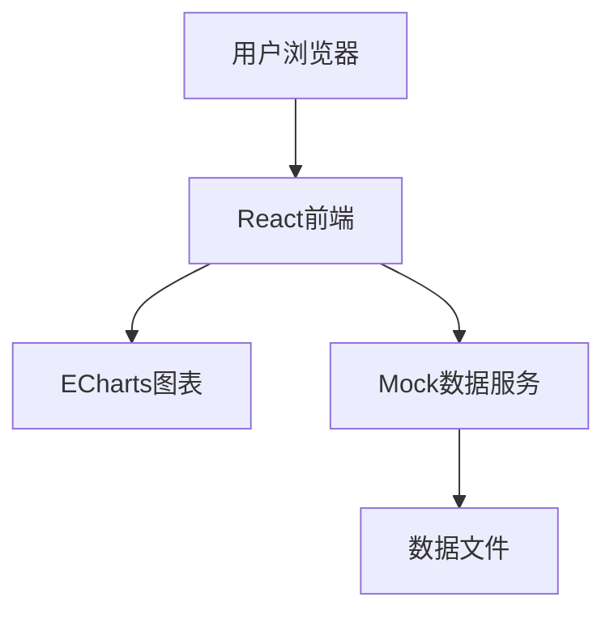
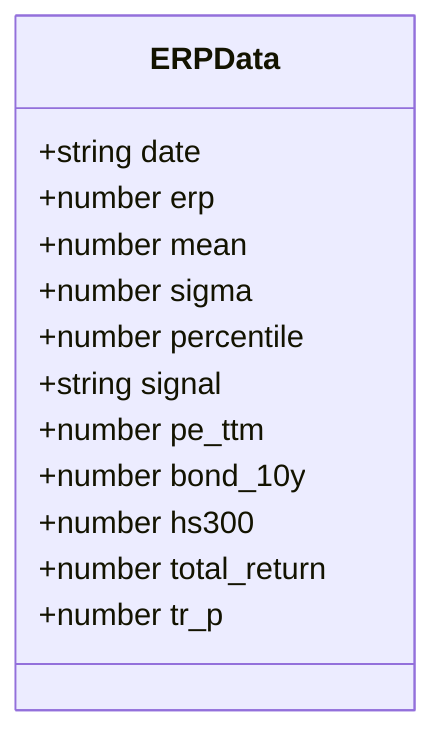

## 1. Architecture Design


## 2. Technology Description
- Frontend: React@18 + tailwindcss@3 + vite
- Initialization Tool: vite-init
- Backend: None (使用Mock数据)
- Chart Library: ECharts@5
- Database: 静态JSON数据文件

## 3. Route Definitions
| Route | Purpose |
|-------|---------|
| / | 首页，展示股债收益比数据和图表 |

## 4. API Definitions
- 后端：使用Mock数据，无需API
- 数据格式：JSON数组，包含日期、ERP、PE、国债收益率、沪深300、全收益等字段

## 5. Server Architecture Diagram


## 6. Data Model
### 6.1 Data Model Definition


### 6.2 Data Definition Language
```json
{
  "data": [
    {
      "date": "2005-04-08",
      "erp": 4.5,
      "mean": 4.46,
      "sigma": 2.34,
      "percentile": 50,
      "signal": "均衡",
      "pe_ttm": 15.2,
      "bond_10y": 3.2,
      "hs300": 980,
      "total_return": 120,
      "tr_p": 0.08
    }
  ]
}
```
